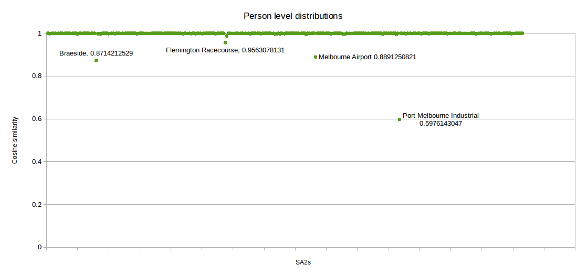

# Constructing The Population

The population covers Greater Melbourne area as specifed in Australian Bureau of Statistics (ABS) data. This includes 309 SA2s. The population statistics were obtained using TableBuilder Pro tool provided in Australian Bureau of Statics (ABS) website(www.abs.gov.au). ESRI shapefiles of mesh block area boundaries and SA2 code specifications were also downloaded from ABS website. ESRI shapefiles of building addresses were taken from Vicmap Data provided in www.land.vic.gov.au.

Already constructed population of the Greater Melbourne is available in `synthetic-population/data/melbourne-2016-population.zip` file. Each household, family and person has unique IDs. So if a subset of SA2s are needed, the files of corresponding SA2s can be merged to get the population.

## Prerequisits
- Git LFS (https://git-lfs.github.com)
- R statistical package (https://www.r-project.org). Required R extra libraries are:
     - stringr
     - optparse
     - Metrics
     - tools
     - testthat
     - futile.logger
     - lsa
     
- JAVA 8 (https://java.com/en/download/)
- Maven (https://maven.apache.org/download.cgi)
- ABS TableBuilder Pro access to download data

## Quick run with default settings
First, either clone the repository to your computer or download as a zip file. Then to generate the populations of Greater Melbourne SA2s with default settings and already downloaded data execute below commands. It installs the required R and Java libraries, synthesises the population,  assigns households to addresses and creates `synthetic-population/data/melbourne-2016-population.zip` file. Refer to "README.txt" file inside the zip file to get the population for a subset of Greater Melbourne SA2s. The whole population will be synthesised in about 30 minutes on a machine with a Intel Core i7 processor and 4GB allocated memory.

        > cd synthetic-population/run
        > ./run.sh

## Components

### Preprocesser
Performes data cleaning routines on household and persons data distributions obtained from ABS.<br />
The data downloaded from ABS often have inconsistencies between the households and persons. This component removes these inconsistencies as much as possible using heuristics observed in human populations. The processed files are saved to `synthetic-population/data/melbourne/generated/SA2/preprocessed`. To run the program with already downloaded data exectute below commands. This will complete in about a minute.

        > cd synthetic-poplation/rscripts
        > ./sa2preprocess.R

### Population Synthesiser
Synthesises the population using preprocessed ABS census data<br />
This program constructs housholds and families using the census data using heuristics on human relationships. This program infers the relationships and families of persons and put them in the households. This also identifies the Statistical Area (SA2 by default) and randomly assigns an address to the household. The main inputs are preprocessed ABS census data files and the json file giving addresses and the corresponding SA1 codes. The full list of input properties can be found in `population.properties` file.

If the program is not already built execute following command
 
        > cd synthetic-population/populationbuilder
        > mvn clean install
        
To run the program execute

        > cd synthetic-population/populationbuilder
        > java -jar synthesis/target/synthesis.jar population.properties

This generates three files as `persons.csv.gz`, `families.csv.gz` and `households.csv.gz`, which are saved under `synthetic-population/data/melbourne/generated/SA2/<SA2 Name>/population/`. This also creates `output_household_types.csv.gz` and `output_person_types.csv.gz` files, which give the summary distributions of households and persons in each SA2.

To only generate person instances set flag `-p` as below:

        > java -jar synthesis/target/synthesis.jar population.properties -p
This will only generate `persons.csv.gz` and `output_person_types.csv.gz` files. None of the other tasks will be performed in this mode.

### Address Mapper
Locates the SA1 that each address belongs to and assigns households to addresses<br />
The addresses obtained from Vicmaps does not have references to ABS Statistical Areas. This component locates the SA1 of each address by matching `MESH_BLOCK` ID property of address with `MB_CODE16` ID property of ABS mesh block area. If a matching mesh block id cannot be found in ABS mesh block area file, the program searches the polygon that the address point is contained geographically. This adds two new properties to address shape file from Vicmap: `ABS_MB16` - the mesh block id used in ABS mesh block area file and `SA1_MAIN16` - the 11 digit SA1 main code. The default updated file is `synthetic-population/data/melbourne-2016-addresses.zip`. 

This also assigns households to addresses at SA1 level. The program reads households from the population generated by the population synthesiser (`synthesis.jar`), finds the SA1s that the households belong to and maps it with an address in the same SA1. If there are not enough addresses multiple households are assigned to the same address. This adds the address under a new property named `EZI_ADD`property in `households.csv.gz`.

To run the addressmapper execute following commands. This may take about 20 minutes for whole Greater Melbourne. The `-Xmx4g` flag is only requied if `-s` option is specified.

        > cd synthetic-poplation/populationbuilder
        > git lfs pull  # Downloads large input data files from the repository
        > mvn clean install  # This builds the project
        > java -Xmx4g -jar addressmapper/target/addressmapper.jar addressmapper.properties -sh
        
The command line parameters of `addressmapper.jar` are as follows
 
 ```
     Usage: java -jar addressmapper.jar <properties file> [Options]
     This program maps addresses obtained from Vicmaps to SA1s in shape files obtained from Australian 
     Bureau of Statistics and assignes households to addresses.

     Options:
        -s=BOOLEAN
            Set this flag to map addresses to SA1s [Default = false].
        -h=BOOLEAN
            Set this flag to map households to addresses [Default = false]. The program requires 
            having the addresses already mapped to SA1s (the output of -s step) to run this step.
``` 
If the addressmapper was already run before with `-s` option it can be ignored for succeeding executions. `-s` option instructs the program to locate the SA1 area of each address point obtained from Vicmap shapefiles. This is a relatively expensive geographical (GIS) processing step, which takes about most of the 20 minutes observed exectution time. If the output file of this step is already available, one can specify `-h` (without `-s`), which instructs the program to only map households to addresses in the corresponding SA1. In this case, the program does not need 4GM RAM and completes in about 20 seconds. The command looks like:
 
         > java -jar addressmapper/target/addressmapper.jar addressmapper.properties -h
 
## Accuracy
1. The algorithm ensures that input household and person level marginal distributions are maintained in the synthesised population to the best possible level.
2. The relationships and family household compostions are ensured realistic.
3. With default settings, the population is generated at SA2 level and redistributed to SA1 level considering SA1 households distribution. Because of that only household properties are accurate at SA1 level. We cannot assure that person level distribution is accurate at SA1 level.
4. The households are assigned to randomly selected addresses within a Statistical Area (SA1 by default). If there are not enough addresses in a given SA, multiple household may be assigned to the same address.

Following image shows accuracy of person distribution in comparison to cleaned (preprocessed) input data distribution. Cosine similarity test gives a value between 1 and -1 depending on the similarity level, 1 is the perfect match. The x-axis of below image gives the SA2s. All SA2s but 4 give Cosine similarity values close to 1.


## Constructing a new population

### 1. Download data using ABS TableBuilder tool

ABS TableBuilder and tutorial can be accessed from this [link](http://www.abs.gov.au/websitedbs/D3310114.nsf/Home/2016%20TableBuilder). You need to know how to create and manage tables, change databases, create custom data fields and download data tables in csv format.

   * Number of persons by Relationship Status (RLHP) by Sex (SEXP) by Age group (AGE5P) by SA2. 

     Construct the below table using "Counting Persons, Place of Usual Residence" database. Codes used for table headers are used in TableBuilder. Remove `Total` fields from the table by clicking on "Hide Total" button (the button with zigma symbol in column and row headers) if it is already selected, and save the table as `synthetic-population/data/melbourne/raw/Persons_2016_Greater_Melbourne_SA2.zip`.
     
     The Filters section above the table will show `Default Summation: Persons Place of Usual Residence`. This describes what is represented by the numbers
     
```
|---------------------------| Persons, Place of Usual Residence |
| SA2 | RLHP | SEXP | AGE5P |                                   |
|-----|------|------|-------|-----------------------------------|
|     |      |      |       |                 x                 |
|     |      |      |       |                 x                 |
```
This tool uses custom  Relationship status and Age groups. Custom categories can be formed by combining existing categories in TableBuilder's "Custom Data" section. The relationship categories are given in `synthetic-population/doc/Custom Individual relationship categories.pdf`. Age groups used here are 0-14, 15-24, 25-34, 35-49, 50-64, ... , 85-99, 100++. 
      
  * Number of dwellings by Number of Persons Usually Resident in Dwelling (NPRD) by Family Household Composition (Dwelling) (HCFMD). 

    Use Construct below table using "Counting Dwellings, Place of Enumeration" dataset and save as `synthetic-population/data/melbourne/raw/Households_2016_Greater_Melbourne_SA2.zip`. This table should not have any `Total` fields.
    
    Following HCFMD categories are not selected
    
     * Visitors only households
     * Other non-classifiable household
     * Not applicable
    
    Following NPRD category is not selected
    
     * Not applicable
     
     The `Filters` section above the table will show `Default Summation: Dwellings Location on Census Night`.

```
|--------------------| Dwellings, Location on census night |
| SA2 | NPRD | HCFMD |                                     |
|-----|------|-------|-------------------------------------|
|     |      |       |                  x                  |
|     |      |       |                  x                  |
```   
         
   * Household composition distributions of each SA2 by SA1s in it. 

     Construct below table in TableBuilder using "Counting Dwellings, Place of Enumeration" dataset for all SA2s and save the files. It may require downloading data as multiple files. For example `synthetic-population/data/melbourne/raw/SA1_households_dist_in_SA2s_2016_Melbourne_Inner.zip`. Remove `Total` fields from the table before saving. Both zip and csv are acceptable for this table.

```
|-----------|------| SA1s  | SA1_CODE1 | SA1_CODE2 | SA1_CODE3 |  ...  |
| SA2 Name  | NPRD | HCFMD |           |           |           |  ...  |
|-----------|------|-------|-----------|-----------|-----------|-------|
| Brunswick |      |       |     x     |     x     |     x     | ..x.. |
|           |      |       |     x     |     x     |     x     | ..x.. |
```   

  * Age distribution of persons in SA2s. 

    Construct the below table using "Counting Persons, Place of Usual Residence" database and save as `synthetic-population/data/melbourne/raw/Persons_percentage_by_age_2016_Greater_Melbourne_SA2s.zip`. Remove `Total` column and row from the table if they are added automatically.

```
| SA2s | SA2_NAME1 | SA2_NAME2 | SA2_NAME3 |  ...  |
| AGEP |           |           |           |       |
|------|-----------|-----------|-----------|-------|
|  1   |     x     |     x     |     x     | ..x.. |
|  2   |     x     |     x     |     x     | ..x.. |
| ...  |     x     |     x     |     x     | ..x.. |
| 115  |     x     |     x     |     x     | ..x.. |
```

### 2. Download required Australian Statistical Geography Standard (ASGS) data cubes

  Download following 2016 files from www.abs.gov.au/AUSSTATS/abs@.nsf/DetailsPage/1270.0.55.001July%202016 . Save them in `data/melbourne/raw/`. 
  
   * [Victoria Mesh Blocks ASGS Ed 2016 Digital Boundaries in ESRI Shapefile Format ](http://www.abs.gov.au/AUSSTATS/subscriber.nsf/log?openagent&1270055001_mb_2016_vic_shape.zip&1270.0.55.001&Data%20Cubes&04F12B9E465AE765CA257FED0013B20F&0&July%202016&12.07.2016&Latest)<br />
   This file covers Victoria and files for other states and teritories can also be downloaded
   
   * [Statistical Area Level 2 (SA2) ASGS Edition 2016 in .csv Format ](http://www.abs.gov.au/ausstats/subscriber.nsf/log?openagent&1270055001_sa1_2011_aust_csv.zip&1270.0.55.001&Data%20Cubes&5AD36D669F284E70CA257801000C69BE&0&July%202011&23.12.2010&Latest)<br />
   This file convers whole Australia. So no need to download again if the popuation is built at SA2 level. If a different SA level is used download the corresponding file.

### 3. Download building address shape files from Vicmap Data website

Building Addresses shape files can be downloaded at www.data.vic.gov.au/data/dataset/address-vicmap-address. The already downloaded addresses shapefiles include Local Government Areas (LGAs) covering Greater Melbourne. The Greater Melbourne area accordig to ABS is larger than area covered by Greater Melbourne Metropoliton LGAs. So the downloaded LGAs include additional LGAs that are outside Greater Melbourne Metropoliton area. The 3 already downloaded address files are `SDM494419.zip`, `SDM494198.zip` and `SDM494202.zip` in `synthetic-population/data/raw/`. It is recomended that address files are downloaded as smaller files as above instead of a one large file covering whole Greater Melbourne area because of memory limitations.
  
## Adding new properties
The household sysnthesis logic is purely heuristics based. Because of that it is difficult to introduce new properties if they influence relationships and family composistions in the population. However, if the new properties do not influence relationships and family compositions the program can be easily extened to retain new properties when the population is synthesised.

For example, to assign income of individuals, we only need to update the code to read the income from the data file and store it as a property of the person instances. This new property will be maintained throughout the population construction and the resulting population will give the distribution of person incomes in differnt households. However, this will not guarantee the correct household income distribution.
